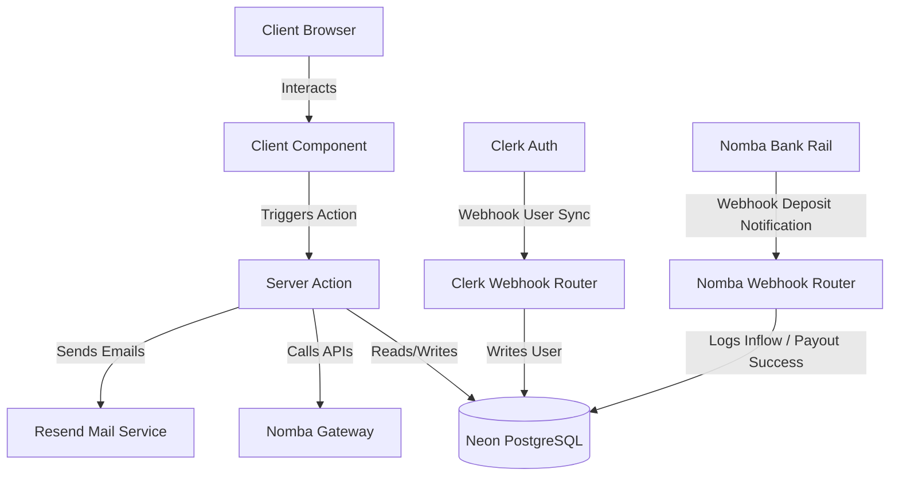

# Architecture

Circle is built as a modular Next.js application. It is designed to scale while maintaining clean separations of concern between server-side operations, database schemas, frontend components, and payment processing adapters.

---

## App Router & Folder Structure

We organize folders based on feature isolation and logical layer responsibilities:

- **`app/`**: Holds Next.js routing files, layout structures, and API route handlers.
- **`components/`**: Divided into `ui/` (shared layout primitives and basic design system nodes) and `shared/` (highly cohesive business widgets like layouts, sidebar, top nav, and cards).
- **`lib/`**: Contains core utility libraries, database connectors, type definitions, server action workflows, and API modules:
  - `lib/db/`: Connection setups and table representations.
  - `lib/actions/`: Functional workflows containing backend interactions, authentication checks, and database updates.
  - `lib/nomba/`: Nomba API connectors, signature validators, and endpoints.
- **`types/`**: Global type declarations and ambient variables.

---

## Layout and Routing Hierarchy

We segregate user states using Next.js route groups:

```text
app/
├── (auth)/
│   ├── onboarding/       # Post-login multi-step registration shell
│   ├── sign-in/          # Clerk Catch-all page
│   └── sign-up/          # Clerk Catch-all page
├── (routes)/
│   ├── dashboard/        # Active user overview shell
│   ├── circles/          # Circle view, creation, and detail actions
│   ├── contributions/    # Log of inflows and reconciliations
│   ├── payouts/          # Log of disbursements and settlement profiles
│   ├── settings/         # Profile management and bank configurations
│   └── layout.tsx        # Authenticated shell layout (Sidebar + TopNav)
├── api/
│   ├── cron/             # Scheduled system routines
│   └── webhooks/         # Clerk and Nomba webhook receivers
├── docs/                 # Public-facing documentation site
└── page.tsx              # Unauthenticated landing page
```

---

## Server vs. Client Components

To optimize bundle sizes and performance, we strictly isolate rendering logic:

### Server Components
- Route page endpoints (e.g. `app/(routes)/dashboard/page.tsx`).
- Load server-side data directly from the Neon database using Drizzle.
- Implement server-side action calls.
- Render static sections (e.g., landing page features, FAQs).

### Client Components
- Prefixed with `'use client'`.
- Capture state, user inputs, hover logic, triggers, and overlays (e.g. `sidebar.tsx`, modals, dynamic forms).
- Bind event handlers to trigger **Server Actions** asynchronously.
- Receive plain-object serializable data down from parent Server Components.

---

## Server Actions & Data Mutations

We manage all data mutations using Next.js **Server Actions** located under `lib/actions/`.
- Server actions are marked with `'use server'` at the top of their respective module files.
- They execute entirely on the server runtime, permitting direct database querying and execution of secure API calls (e.g., calling Nomba's gateway).
- They perform validation on incoming parameters (using Zod or standard schemas) and inspect active user sessions via Clerk's server-side authentication state helpers.
- They return plain serializable responses using a unified wrapper format:
  ```typescript
  export interface ActionResponse<T> {
      success: boolean;
      data?: T;
      error?: string;
  }
  ```

---

## Technical Architecture Overview

The system coordinate flows are diagrammed below:


