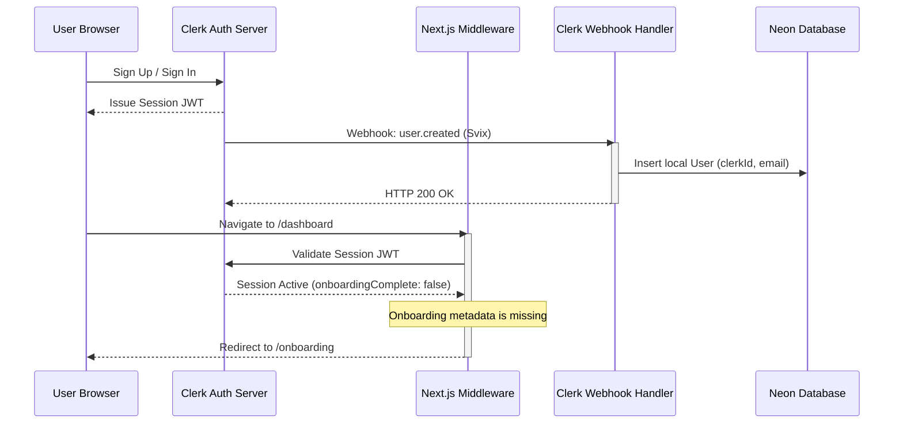

# Authentication

Circle integrates **Clerk** for user authentication, session state management, and user profiles. Clerk gates all paths, verifies tokens, and provides hooks for user profile edits. Circle uses Clerk's metadata database syncing to enforce onboarding.

---

## Authentication flow & user synchronization

Circle mirrors user records locally in Neon database using **Svix webhooks** to facilitate relational queries (e.g. tracking memberships, ownerships, and contributions).



---

## Middleware & Route Access Gates

The Next.js middleware file (`middleware.ts`) gates incoming requests. It is configured to run on all routes except internal assets, Next.js optimization files, and specific static files.

Inside the middleware:
- **Public Routes:** `/`, `/test`, `/sign-in(.*)`, `/sign-up(.*)`, `/api(.*)`, `/invitations(.*)`, and `/docs(.*)`. These can be loaded without an active session token.
- **Onboarding Check:** If a user is authenticated but does not possess the `onboardingComplete: true` claim in their session metadata, the middleware forces a redirection to `/onboarding`.
- **Private Routes:** Any route not matched by the public route checker requires a valid Clerk token, redirecting unauthenticated visitors to `/sign-in`.

---

## Onboarding Metadata Enforcements

To minimize database queries during routing, onboarding completion state resides directly inside Clerk's metadata structure:
- After completing onboarding details, the `completeOnboarding` server action updates Clerk’s metadata using the Clerk Backend SDK:
  ```typescript
  const clerk = await clerkClient();
  await clerk.users.updateUserMetadata(clerkUserId, {
      publicMetadata: {
          onboardingComplete: true,
          activeCircleId: circleId,
      },
  });
  ```
- The client refreshes the user session token (`await user?.reload()`).
- The augmented JWT claims are type-cast and read in the middleware:
  ```typescript
  if (isAuthenticated && !sessionClaims?.metadata?.onboardingComplete) {
      return NextResponse.redirect(new URL('/onboarding', req.url));
  }
  ```

---

## Accessing Authentication State

### Server-Side (Server Components & Actions)
Use Clerk's `@clerk/nextjs/server` package helpers inside backend routes and server actions:
- **Retrieve User ID:** `const { userId } = await auth();`
- **Retrieve Detailed User Profile:** `const user = await currentUser();`
- **Call Backend APIs:** `const clerk = await clerkClient();`

### Client-Side (Client Components)
Use Clerk's `@clerk/nextjs` hooks inside client files:
- **Fetch Active User Object:** `const { user } = useUser();`
- **Check Session State:** `const { isLoaded, isSignedIn } = useAuth();`
- **Render Auth UI Buttons:** `<UserButton />`, `<SignInButton />`, etc.
