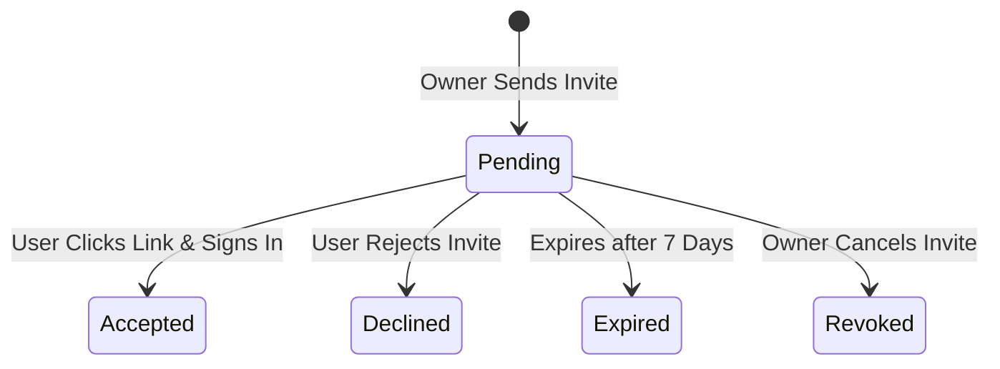

# Circle Management

A **Circle** is a collaborative savings collective where members pool money on a recurring timeline. This guide details how circles are created, joined, configured, and how roles and rotation cycles are governed.

---

## Creating & Configuring Circles

Circles are created either during the onboarding stage or directly from the dashboard after creation. When configuring a circle, the owner defines:
- **Name & Description:** Display details for the circle.
- **Contribution Amount:** The fixed sum each member must pay per round (defaults to `₦50,000.00`).
- **Frequency:** How often collections occur. Defaults to `monthly` (supports `weekly`, `bi-weekly`).
- **Currency:** Set to `NGN` (currently the only supported currency due to Nomba banking limitations).
- **Visibility:** Can be configured as:
  - `invite_only`: Invisible to search, requiring a specific invitation link/token.
  - `private`: Direct URL-only access, only visible to members.

---

## Member Invitation Lifecycle

Circles grow by inviting members. The invitation flow operates as follows:

1. **Invite Generation:** An admin or owner specifies a user email. The system inserts a row in `invitations` with a unique UUID `token` and sets an expiry date (7 days from creation).
2. **Delivery:** The system dispatches an email via Resend containing a signed link: `https://<domain>/invitations/<token>`.
3. **Acceptance:** When the recipient visits the link:
   - If they are not logged in, they are prompted to authenticate via Clerk.
   - Once logged in, their user record is matched, and clicking "Accept" adds them to `circle_members` as `active`. The invitation status changes to `accepted`.

---

## Roles & Permissions Matrix

Circle memberships are defined in the `circle_members` table and carry specific roles:

| Action / Permission | Owner | Admin | Treasurer | Member |
| :--- | :---: | :---: | :---: | :---: |
| Edit Circle Config | Yes | Yes | No | No |
| Invite Members | Yes | Yes | No | No |
| Reconcile Deposits | Yes | Yes | Yes | No |
| Initiate Payouts | Yes | Yes | Yes | No |
| Change Member Roles | Yes | Yes | No | No |
| Delete Circle | Yes | No | No | No |
| Make Contributions | Yes | Yes | Yes | Yes |

- **Owner:** The creator of the circle. Has full administration privileges, including deleting the circle and changing owner status.
- **Admin:** Handles configurations, invites, role overrides, payouts, and deposit reconciliations.
- **Treasurer:** Focuses entirely on financial operations: reconciling deposits and initiating payouts.
- **Member:** Participates in contributions, receives payouts, and views the dashboard ledger.

---

## Rotation Schedules & Payout Dates

Circle payouts operate on a **rotational round basis**:
- When members join a circle, they are assigned a `rotation_position` (e.g. 1, 2, 3).
- The `rotation_position` dictates the round in which they receive the cumulative pool payout.
- **Payout Dates:** The system computes the estimated payout date based on the circle's creation date, rotation position, and savings frequency (weekly, monthly).
- For example, in a ₦50,000 monthly circle with 5 members:
  - Round 1: Member at position 1 receives ₦250,000.
  - Round 2: Member at position 2 receives ₦250,000.
  - Round 3: Member at position 3 receives ₦250,000, and so on.
