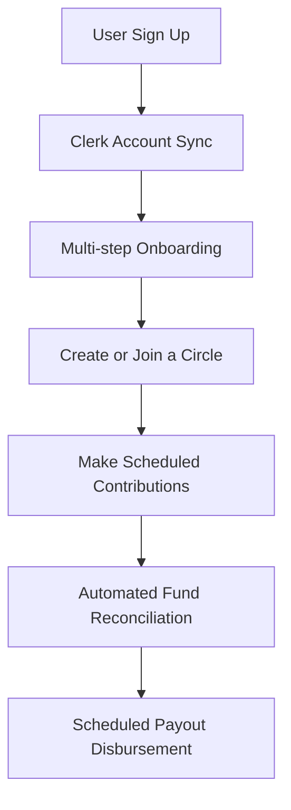

# Introduction to Circle

Welcome to the **Circle** developer documentation. Circle is a modern community finance and collaborative savings platform designed to digitize, secure, and automate traditional rotational savings groups—commonly known as **Ajo**, **Esusu**, or **Pardna** across various cultures.

Traditional informal savings groups rely heavily on manual ledger-keeping, mutual trust, cash-handling, and verbal coordination. Circle bridges this gap by providing a transparent, automated, and secure digital framework for group contributions, fund management, and payouts.

---

## Business Purpose & Goals

Informal savings arrangements are a cornerstone of community finance, yet they suffer from operational risks including default, lack of transparency, record manipulation, and high administrative overhead.

Circle is built to:
1. **Automate rotative payouts:** Ensure contributions are automatically collected and disbursed to members on scheduled dates based on pre-defined rotation schedules.
2. **Improve transparency:** Offer a real-time ledger where members can track who has paid, who is next in line for a payout, and audit the group's financial state.
3. **Minimize default risks:** Integrate banking rails to track virtual accounts, verify identities, and facilitate automated bank transfers.
4. **Digitize coordination:** Provide structured onboarding, instant member invitations, email notifications, and dashboard stats to replace WhatsApp groups and Excel sheets.

---

## Core Features

- **Circle Creation & Management:** Owners can define savings rules, set contribution amounts (e.g., ₦50,000 monthly), set frequencies, and manage participants.
- **Dedicated Virtual Accounts:** Every circle gets a dedicated bank account number provisioned through **Nomba API** for direct member deposits.
- **Rotational Payouts System:** Automated tracking of payout order positions, payout dates, and scheduled bank transfers to members' personal accounts.
- **Deposit Reconciliation:** Managers can audit incoming deposits, matching bank-notified transfers to members and contribution rounds.
- **Real-Time Notification Ledger:** Inside-app warnings and email notifications keeping members informed of due dates, successful collections, and disbursements.

---

## High-Level Architecture

Circle is built as a highly performant, server-first Next.js web application utilizing:
- **Next.js (App Router)** for rendering, routing, and server-side data operations.
- **Clerk** for customer identity verification, secure login, and onboarding state management.
- **Drizzle ORM + PostgreSQL (Neon)** as the serverless data layer.
- **Nomba API** for creating virtual accounts and disbursing payouts via instant NGN bank transfers.

---

## The User Journey

1. **Sign Up & Auth:** The user joins via Clerk, creating an account.
2. **User Sync:** Clerk fires webhooks to sync the user profile into the database.
3. **Onboarding:** The user fills in personal details and either creates a new Circle or joins an existing one.
4. **Participation:** Members receive virtual account details for deposits.
5. **Reconciliation:** Incoming transfers are logged and matched to contribution rounds.
6. **Payout:** The round ends, and a payout is disbursed to the scheduled member.
