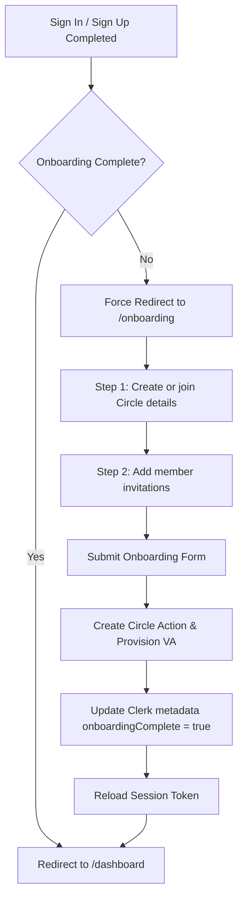

# Onboarding

Onboarding is a critical post-login registration flow that transitions a newly created authenticated account into an active member of a Circle. Users cannot skip this stage; the middleware redirects non-onboarded visitors back to `/onboarding`.

---

## Onboarding Lifecycle Flow

When a user signs up for the first time, their database user record is generated automatically via Clerk webhooks, but their onboarding status remains incomplete. They are greeted by the onboarding form.



---

## Validation & Zod Schema

The onboarding details are validated in both client and server layers using **Zod**. The schema resides in `components/forms/schema/circleFormSchema.ts`:
- **`name`**: Required string, between 3 and 100 characters.
- **`slug`**: Optional URL-friendly string. If empty, the backend generates one from the circle's name.
- **`description`**: Optional detail text.
- **`privacy`**: Enforces either `private` or `invite_only` visibility modes.
- **`members`**: Array of invitation objects containing:
  - `email`: Required valid email address.
  - `name`: Required contact display name.
  - `role`: Role assigned to the invitee (`Member` or `Admin`).

---

## Technical Persistence & Actions

Once the user submits the onboarding form:

1. **Circle Provisioning:** The client executes the `completeOnboarding` server action.
   This action runs `createCircleAction` which:
   - Inserts the new row into the `circles` table.
   - Triggers the **Nomba API** request to provision a dedicated virtual bank account reference for the Circle.
   - Inserts the virtual account properties into the `virtual_accounts` table.
   - Registers the creator as the Circle's owner in the `circle_members` table at rotation position `1`.
   - Automatically inserts rows into `invitations` and dispatches invite emails via the Resend API to all listed member emails.

2. **Session Metadata Sync:** Upon successful circle database creation, the action updates Clerk's `publicMetadata` database:
   ```typescript
   const clerk = await clerkClient();
   await clerk.users.updateUserMetadata(userId, {
       publicMetadata: {
           onboardingComplete: true,
           activeCircleId: insertedCircle.id,
       },
   });
   ```

3. **Session Refresh:** In the browser, the client reloads the Clerk session (`await user?.reload()`) to update the token claims and pushes the router to `/dashboard`.

---

## Recovery & Edge Cases

- **Partial Failures (Virtual Account Provisioning Failure):** If Nomba's API throws an error during onboarding, the database transaction is rolled back, preventing orphaned circles. The user is shown an error alert and can resubmit.
- **Clerk Sync Error:** If the circle is created but Clerk metadata fails to update, the action returns `success: true` but includes an alert error. The user is prompted to reload the page to retry token synchronization.
