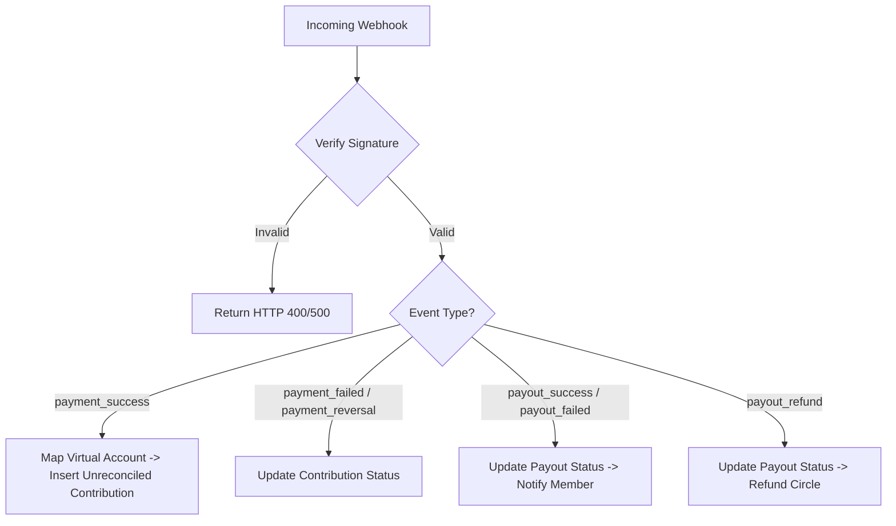

# Payment System (Nomba API)

Circle leverages the **Nomba API** for banking infrastructure, virtual accounts, name lookups, and bank transfers. All code interfaces reside in `lib/nomba/`.

---

## 1. Credentials & Configuration

Nomba connection settings are initialized in `lib/nomba/config.ts` from environment variables:
- **`clientId` & `clientSecret`:** Used to fetch OAuth tokens.
- **`accountId`:** Circle's main merchant profile identifier.
- **`subAccountId`:** Used to route virtual accounts creation and fund collections.
- **`baseUrl`:** Target environment API URL (Sandbox or Production).

---

## 2. API Authentication & Token Cache

Nomba uses OAuth 2.0 access tokens. To avoid making authentication calls on every single API request, `lib/nomba/client.ts` implements a module-level token cache:
- **In-Memory Storage:** The `CachedToken` object stores `accessToken`, `refreshToken`, and `expiresAtMs`.
- **Concurrency Lock:** Concurrent requests share a single, in-flight token refresh promise (`inflight`) to prevent redundant authentication calls.
- **Auto-Refresh:** If a token expires (evaluated with a 5-minute safety buffer) or returns a `401` status, the client attempts a refresh. If the refresh fails, it issues a fresh token.

---

## 3. Provisioning Virtual Accounts

When a circle is created, the system provisions a dedicated virtual bank account:
- **Endpoint:** `POST /v1/accounts/virtual/${subAccountId}`
- **Payload:**
  ```json
  {
    "accountRef": "circle_uuidWithoutDashes",
    "accountName": "Circle CircleName"
  }
  ```
- **Response:** Returns account details containing the bank name (e.g. `Nomba MFB` or `Wema Bank`) and account number.
- **Storage:** These details are persisted in the `virtual_accounts` table.

---

## 4. Webhook Signature Verification

Webhooks are critical for receiving real-time deposit notifications. To prevent spoofing, Circle validates the signature on every webhook request.

The validation logic in `lib/nomba/webhook.ts` checks:
1. **Header Checks:** Requires headers `nomba-signature` and `nomba-timestamp`.
2. **HMAC-SHA256 Signer:** Computes signature using the raw request body, the timestamp, and the shared `NOMBA_WEBHOOK_SIGNATURE_KEY`:
   ```typescript
   const expectedSignature = crypto
       .createHmac('sha256', signatureKey)
       .update(`${timestamp}.${rawBody}`)
       .digest('hex');
   ```
3. **Comparison:** If the computed signature matches the header signature, the payload is verified.

---

## 5. Webhook Event Router

Verified webhook events are processed in `app/api/webhooks/nomba/route.ts`:



- **`payment_success`:** A member has deposited funds. The webhook maps the virtual account reference, logs an unreconciled contribution, and notifies circle managers.
- **`payout_success` / `payout_failed`:** Updates the payout transaction status and fires success/failure notifications to the beneficiary.
- **`payout_refund`:** Sets the payout status to `refunded` and alerts the user that the funds have been returned.
