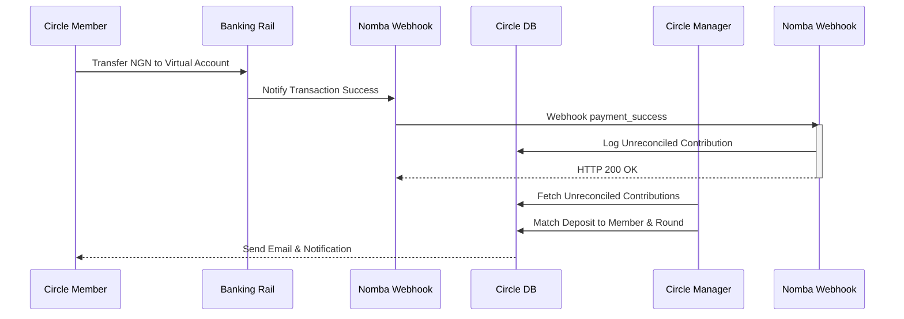

# Transactions & Ledger System

Circle runs on a dual transaction architecture:
1. **Contributions (Inflows):** Money deposited by members into a Circle's virtual bank account.
2. **Payouts (Outflows):** Scheduled payouts disbursed to a member's personal bank account.

---

## 1. Contributions (Inflow Lifecycle)

Circle uses Wema Bank / Nomba MFB virtual accounts to receive deposits. Here is how inflows flow through the system:

---

## 2. Deposit Reconciliation

When a bank deposit is received via Nomba's webhooks, the system does not know which circle member initiated the transfer, as it is a standard inter-bank bank transfer. 
- The incoming contribution is logged in the `contributions` table with `reconciled: false` and `userId: null`.
- The system parses the sender info (e.g. `senderName`, `senderAccountNumber`, `senderBank`) and saves it.
- **Manual Mapping:** A circle manager or treasurer views the list of **unreconciled deposits** on the contributions panel.
- The manager selects the matching member from a dropdown, indicates the target **Round** (e.g. "Round 1"), and clicks "Reconcile".
- The `reconcileContributionAction` server action executes:
  - Updates the contribution row: `reconciled = true`, `userId = memberId`, `round = roundName`, `reconciledBy = adminId`.
  - Fires an email notification to the member confirming their contribution was logged.
  - Generates an in-app transaction success notification.

---

## 3. Payouts (Outflow Lifecycle)

When a round ends and a member is scheduled for a payout (based on their `rotation_position`), an owner, admin, or treasurer initiates a payout.

### Execution Process
1. **Initiate Payout:** The manager navigates to the Payouts tab, selects the beneficiary, enters the round number, and triggers the disbursement.
2. **Verify Destination Bank Profile:** The system fetches the beneficiary's settlement profile (`payoutAccountNumber`, `payoutBankCode`) from the database.
3. **Execute API Transfer:** The backend triggers a Nomba payout request (`POST /v2/transfers/bank/${subAccountId}`) with a unique `merchantTxRef` (prefixed with `payout_`).
4. **Persist Record:** An entry is inserted into `payouts` with a status of `pending`.
5. **Webhook Finalization:** Nomba processes the transfer asynchronously. Upon completion (either success or failure), Nomba fires webhooks which finalise the database status:
   - `payout_success`: Sets status to `success`, sends an email confirmation, and issues an in-app success notification.
   - `payout_failed`: Sets status to `failed` and triggers a failure notification so the treasurer can inspect the issue and retry.
   - `payout_refund`: Sets status to `refunded`, notifying the member and recording the return of funds.

---

## 4. Safety & Idempotency Rules

To prevent duplicate transactions, double payments, or race conditions, Circle implements the following safety checks:
- **Idempotency Keys:** Every payout requests carries a unique transaction reference (`merchantTxRef`). Nomba rejects any repeated request containing an identical key.
- **Double Reconciliation Protection:** In `reconcileContributionAction`, a check is performed to ensure the selected contribution ID is not already marked as `reconciled`.
- **Double Payout Protection:** Before executing a payout, the system verifies that no `success` or `pending` payout record exists for that same user in the specified round.
- **Rollback Operations:** If the external API call fails during initialization, the transaction is rejected, and no row is committed to the database.
